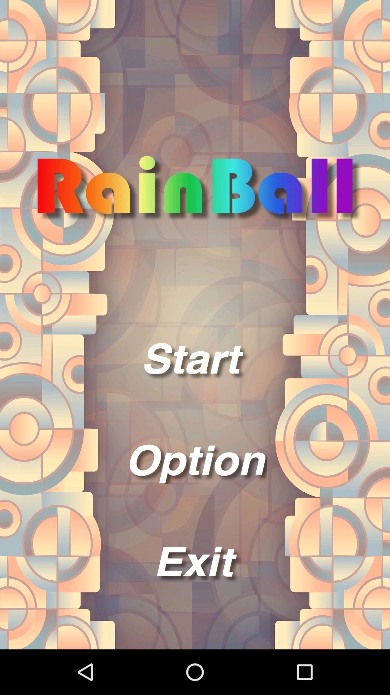
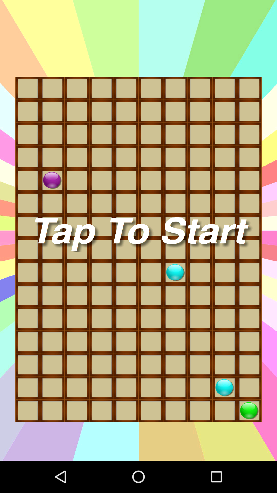
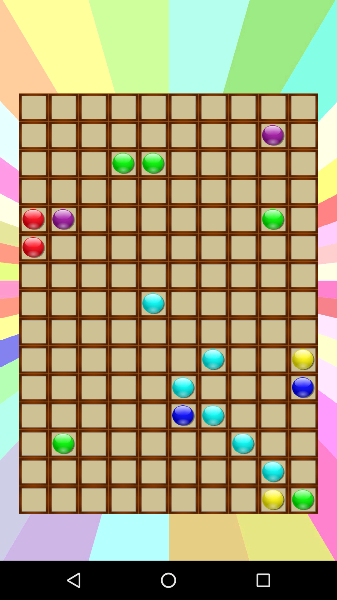
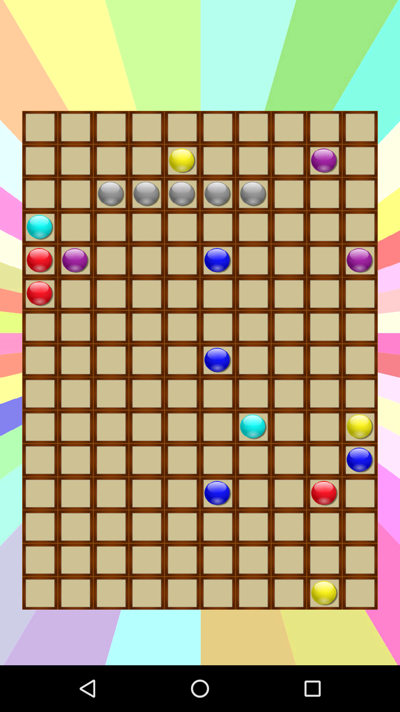

# RainBall

Simple **RainBall** Android Game (Five in a row) Please ignore my poor UI design...

My first Android game development. Integrated A star path finding algorithm and simple gaming framework like Graphics, Audio, Touch handler, etc.

  
 

## License
MIT © [lcgforever](https://github.com/lcgforever)
